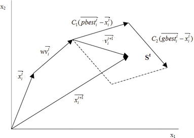

```{r setup, include=FALSE}
knitr::opts_chunk$set(echo = FALSE)
library(dplyr)
library(data.table)
library(plotly)

for(src in list.files("R/")){
  sourde(paste0("R/", src))
}
```


## Agenda

- Entstehung
- Standard PSO
- Beispiel 2D
- Nebenbedingungen
- Beispiel 2D mit Nebenbedingungen
- Konvergenz
- Vor- und Nachteile
- Fazit


## Entstehung

- Erfunden von Russell Eberhardt und James Kennedy in 1995
<div class="columns-2"> 
<div class="centered">
{width=180px} 
<div/>
<div/>
<div class="columns-2"> 
<div class="centered">
{width=200px} 
<div/>
<div/>
- Analogie zu natürlichen Vogelschwärmen
- PSO ist eine naturanaloge Metaheuristik
- Erste Anwendung in der Teilchenphysik

<div class="notes">
- Metaheuristik ist Optimierungsveerfahren
- (bild1) Russell C. Eberhart professor of Electrical and Computer Engineering
- (bild2) James Kennedy (social psychologist)
</div>


## Partikelschwarmoptimierung Grundlagen
Optimierungsproblem:  

-  Lösungsraum $\Omega$ (z.b. $\mathbb{R}^n$)
-  Zielfunktion: $f: \Omega \rightarrow \mathbb{R}$
-  Gesucht ist $\omega \in \Omega$ für das $f(\omega) = min\{f(x)|x \in \Omega\}$ gilt
\
\

Vehalten des PSO:  

- Partikel bewegen sich im $\mathbb{R}^n$ iterativ
- Partikel teilen sich Informationen
- Partikel haben ein Gedächtnis
- Partikel ändern ihren Richtungsvektor abhängig von 3 Faktoren
- Iteriere bis die Abbruchbedingung erreicht ist


## Standard PSO (SPSO)

1. Initialisiere zufällige Positionen $x^{k, i}$ und Richtungsvektoren $v^{k, i}$ der Partikel $k$ in Iteration $i=0$

2. Evaluiere die Kostenfunktion mit der Position jedes Partikels

3. Speicher die bisher beste Position in $g_{best}^i$

4. Speicher die bisher beste Position pro Partikel in $p_{best}^{k,i}$

5. Iterationsschritt $i \rightarrow i+1$ pro Partikel $k$:
$$
\begin{aligned}
  v^{k, i+1} &= w \cdot v^{k, i} + c_p \cdot r_1 \cdot (p_{best}^{k,i}-x^{k,i}) + c_g \cdot r_2 \cdot (g_{best}^{k,i}-x^{k,i}) \\
  x^{k, i+1} &= x^{k, i} + v^{k, i+1}
\end{aligned}
$$
6. Wiederhole Schritt 2-5 bis die Abbruchbedingung erreicht ist


## SPSO Zeitschritt
$$
\begin{aligned}
  v^{k, i+1} &= w \cdot v^{k, i} + c_p \cdot r_1 \cdot (p_{best}^{k,i}-x^{k,i}) + c_g \cdot r_2 \cdot (g_{best}^{k,i}-x^{k,i}) \\
  x^{k, i+1} &= x^{k, i} + v^{k, i+1}
\end{aligned}
$$
\
<div class="centered">

</div>

<div class="notes">
- bild: https://www.intechopen.com/chapters/69586
</div>


## Einfaches Beispiel

Zielfunktion:  
$$
\begin{aligned}
  f(x, y) =& -20\cdot e^{-0.2 \cdot \sqrt{0.5 \cdot ((x-1)^2 + (y-1)^2)}} \\
  & \ - e^{0.5 \cdot ( cos(2\cdot \pi \cdot x) + cos(2\cdot \pi \cdot y))} + e + 20
\end{aligned}
$$
Aufgabe:  
Minimiere $f(x,y)$ mit $-10 \leq x \leq 10$ und $-10 \leq y \leq 10$

[PSO App](https://acrocode.shinyapps.io/PSO-App/)


## Nebenbedingungen

Beispiele:  

- Summe soll 100% ergeben
- Summe der Gewichte von Elementen mit Ausprägung A soll weniger als 20% betragen
- Kosten sollen kleiner als 100 Euro sein
- Weniger als 20 Elemente sollen ungleich Null sein
- ...

Methoden:  

- Penalty
- Verwerfen von ungültigen Lösungen
- Reparieren von ungültigen Lösungen


## Penalty Methode

Alte Zielfunktion: $f(x)$ mit $f: \mathbb{R}^n \rightarrow \mathbb{R}$

Bruch von Nebenbedingungen: $g(x)$ mit $g(x) \geq 0 \ \forall x \in \mathbb{R}^n$

Neue Zielfunktion: $z(x) = f(x) + g(x)$

Beispiel für gängige Nebenbedingungen:
$$
  A^T \times x \geq b_0
$$
Dann könnte $g(x)$ wie folgt aussehen:
$$
g(x) = ||\vec{\lambda}( A^T \times x - b_0 )||_2^2
$$
mit elementweiser Anwendung von
$$
  \lambda(x) = \begin{cases}
  0 &\text{ if }x \geq 0\\
  x &\text{ if }x < 0
  \end{cases}
$$

## Penalty Methode Beispiel 2D
Gomez and Levy function (modified)  

[wiki constrained tests problems](https://en.wikipedia.org/wiki/Test_functions_for_optimization)  

[PSO App](https://acrocode.shinyapps.io/PSO-App/)  


## Konvergenz
Convergence Analysis for Particle
Swarm Optimization (von Berthold Schmitt)

"Obwohl das PSO in zahlreichen realen Anwendungen verwendet
wird, haben theoretische Betrachtungen bisher nur einige wenige Teilaspekte
des Algorithmus erklärt. Ein solcher Aspekt, mit dem sich viele Wissenschaftler
auseinandersetzen, ist das Phänomen der Konvergenz des Partikelschwarms.
Das bedeutet, dass die Partikel gegen einen Punkt im Suchraum
konvergieren. Insbesondere konnten notwendige und hinreichende Bedingungen
an die Schwarmparameter ermittelt werden, unter denen Konvergenz gewährleistet
ist. Allerdings ist bis jetzt kein theoretisches Resultat über die Qualität
dieses Grenzwertes bekannt, das für den unmodizierten PSO-Algorithmus
in einer allgemeineren Situation als beispielsweise nur für genau eine Zielfunktion
bewiesen werden konnte."

- Alles stark simplifiziert: Standard PSO und $p_{best}=g_{best}=const$
- Es kann gezeigt werden, das folgende Terme fast sicher konvergieren: $\lim\limits_{n \rightarrow \infty}E(X^n)=\mu$ und $\lim\limits_{n \rightarrow \infty}Var(X^n) = \sigma^2$
- Es kann keine Aussage über die Qualität dieses Grenzwertes gemacht werden.
- Es kann bewiesen werden, das wenn der Schwarm im $\mathbb{R}$ konvergiert, das es fast sicher ein locales Minimum ist.


## Interpretation der Konvergenz Aussagen


## Konvergenz Beispiel 1D
- Konstantes $p_{best}=5$ und $g_{best}=7$
- Partikel sind unabhängig
- Hyperparameter $w=0.3$, $c_p=1$, $c_g=1$ 
- Initialisierte Position und Richtungsvektor $X^0=V^0=0$
```{r, echo=F, cache=T, out.height="350px"}
set.seed(0)
w <- 0.3
c_p <- 1
c_g <- 1

P <- 5
G <- 7

X <- 0
V <- 0

N <- 1000000
save_X <- rep(NA, N)
for(i in 1:N){
  V <- w*V+c_p*runif(1)*(P-X)+c_g*runif(1)*(G-X)
  X <- X + V
  save_X[i] <- X
}

mu <- (c_p*P+c_g*G)/(c_p+c_g)
#f <- 1-((1+w-(c_p+c_g)/2)^2+1/12*(c_p^2+c_g^2)-w)*(1-w)-w^3

f <- -(c_p+c_g)*w^2+(1/6*c_p^2+1/6*c_g^2+1/2*c_p*c_g)*w+c_p+c_g-1/3*c_p^2-1/3*c_g-1/2*c_p*c_g

var <- 1/6 * ((c_p*c_g)/(c_p+c_g))^2*(G-P)^2*(1+w)/f

x_ticks <- seq(1,length(save_X), length.out=100)
X_mu <- sapply(x_ticks, function(z){mean(save_X[1:z])})
X_var <- sapply(x_ticks, function(z){var(save_X[1:z])})

p1 <- plot_ly(x=x_ticks, y=X_mu, type="scatter", mode="lines", name="est_mu(X)") %>% 
  add_trace(x=x_ticks, y=mu, name="mu(X)") %>% 
  layout(yaxis=list(title="mu"), xaxis=list(title="iter"))

p2 <- plot_ly(x=x_ticks, y=X_var, type="scatter", mode="lines", name="est_var(X)") %>% 
  add_trace(x=x_ticks, y=var, name="var(X)") %>% 
  layout(yaxis=list(title="var"), xaxis=list(title="iter"))

subplot(p1, p2, nrows=2, titleX = T, titleY = T, shareX = T) %>% 
  config(displayModeBar = FALSE)
```
$f=$ `r f`

## Vor- und Nachteile
Nachteile:  

- keine Garantie für die Qualität der Lösung
- Hyperparameter
- zusätzliche Information über das explizite Problem kann nur schwer berücksichtigt werden
\
\

Vorteile:  

- ist sehr effizient implementierbar (kleine Datenstruktur und nur Basis-Operatoren)
- simple Anwendbar auch bei komplexen Problemen und Nebenbedingungen
- kann diskrete Probleme lösen
- es gibt viele Varianten, die deutlich besser sind als das Standard PSO
- Allzweck-Werkzeug für Optimierungsprobleme


## Fazit

PSO nur verwenden, wenn keine analytische Lösung möglich ist oder diese zu aufwändig wäre
\
\
<p align="center">
{width=350px} 
</p>


